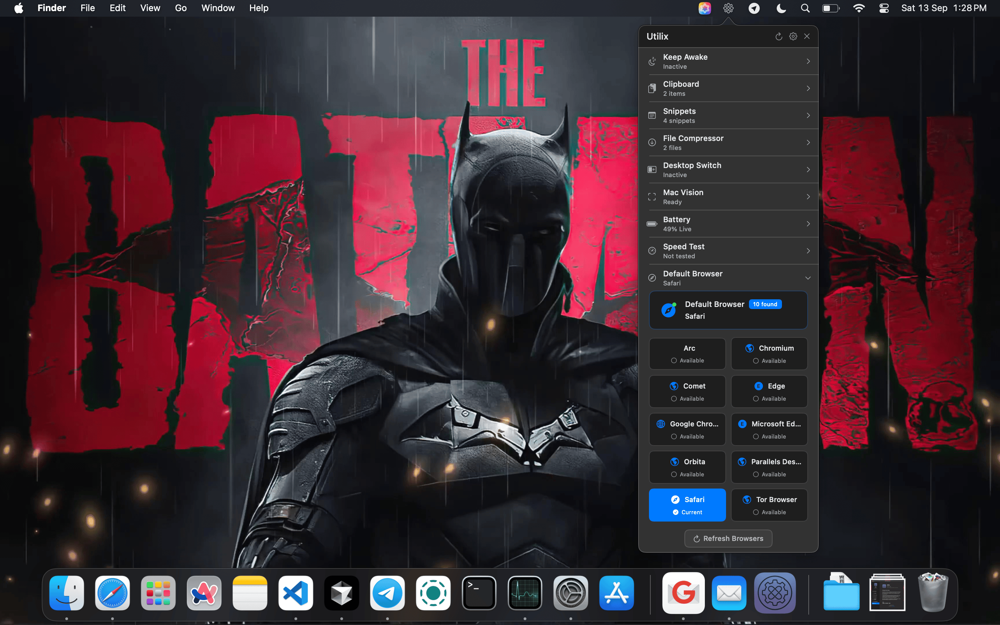
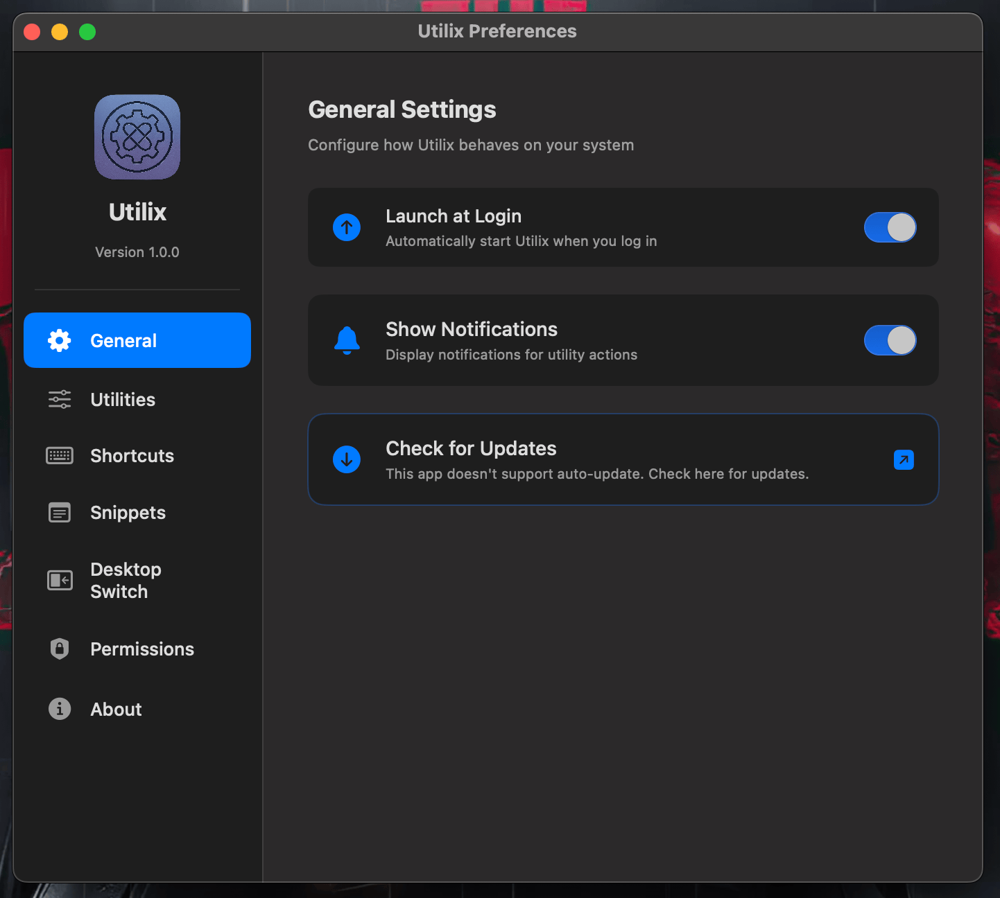
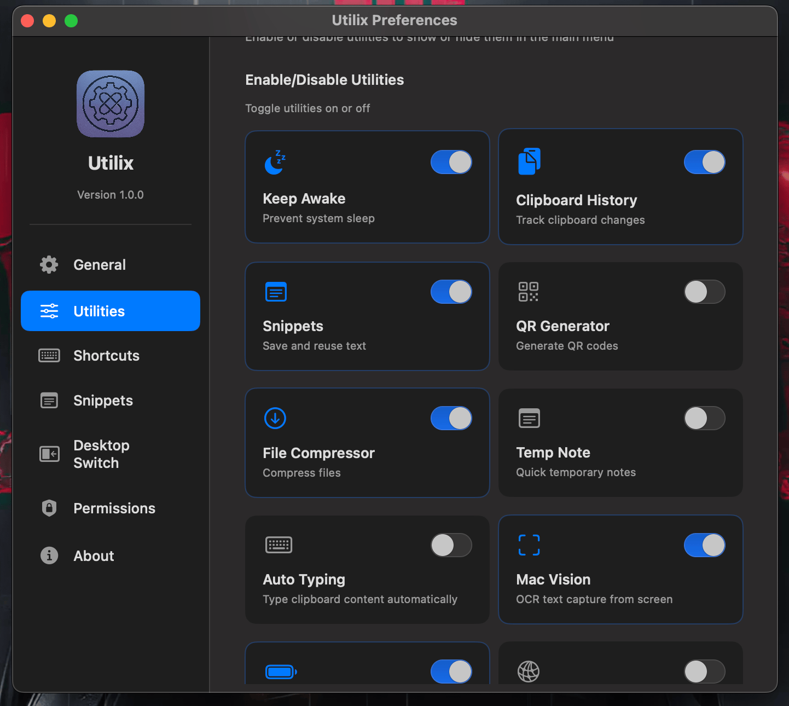
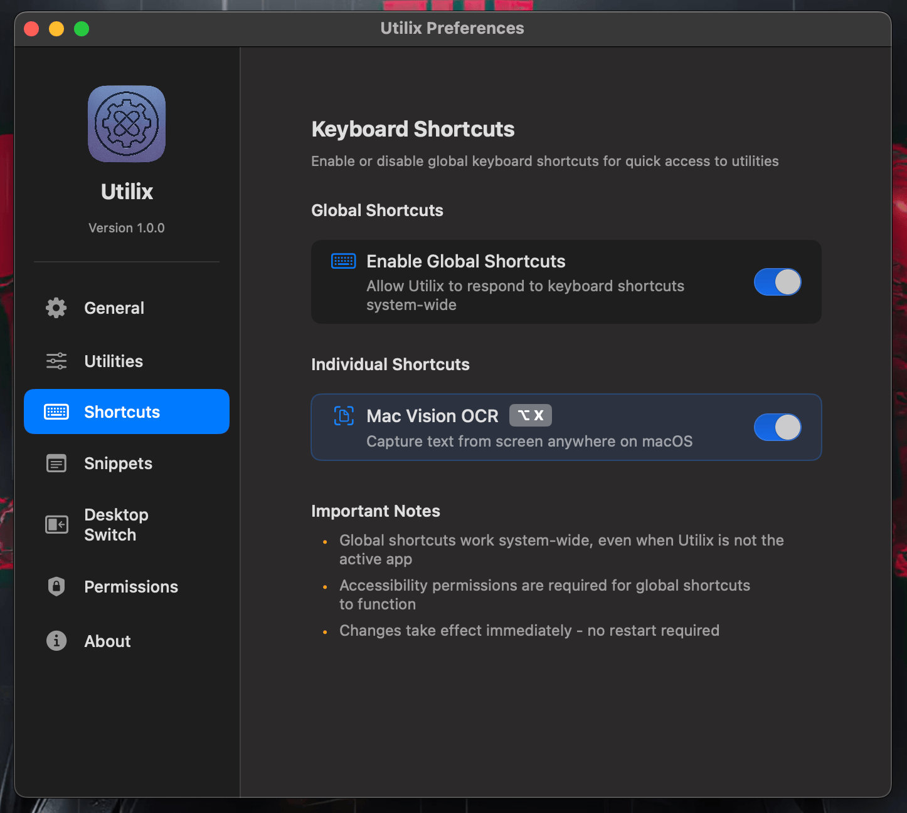
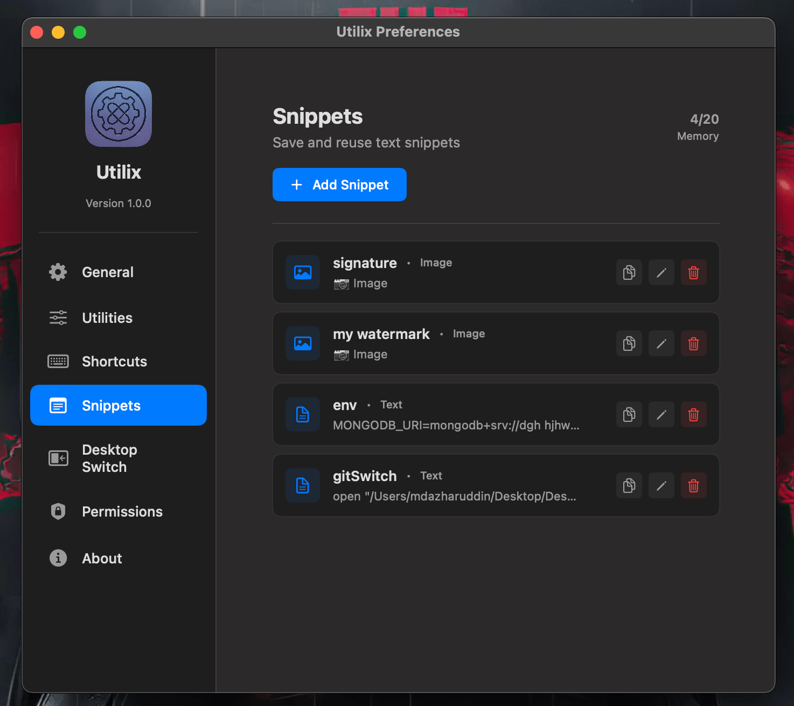
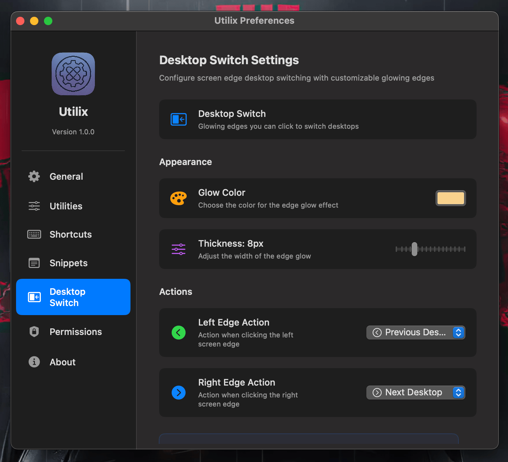
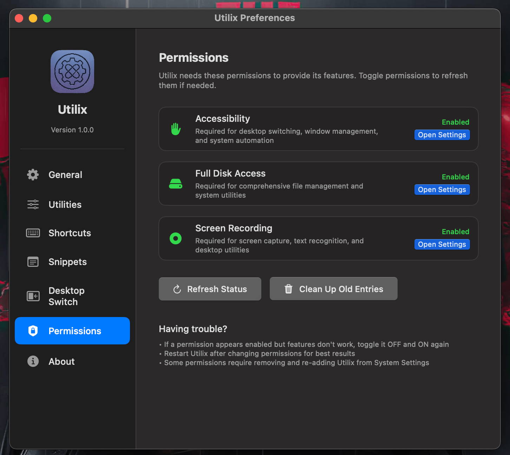
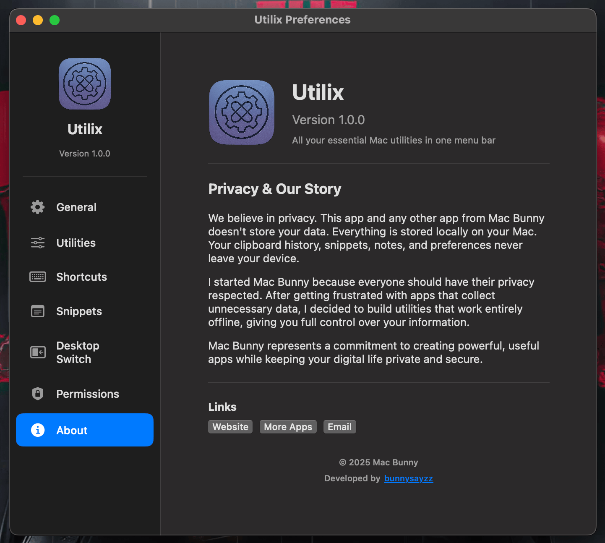

# Utilix — Community Repository

Website: [macbunny.co/utilix](http://macbunny.co/utilix)

This is the public, community-facing repository for Utilix. The app itself is closed‑source; this repository is for documentation, releases, issue tracking, and community discussions only. There is no application source code in this repo.

## What is Utilix?
Utilix is a lightweight macOS menu bar app that bundles everyday utilities into one place.

## Features
- Keep Awake: Prevent system sleep on demand
- Clipboard History: Track and reuse clipboard entries
- Snippets: Save reusable text and image snippets
- QR Generator: Create QR codes quickly
- File Compressor: Compress files from the menu bar
- Temp Note: Jot down quick temporary notes
- Auto Typing: Type clipboard content automatically
- Mac Vision (OCR): Capture text from the screen anywhere on macOS
- Battery Health: Monitor battery status at a glance
- Network Monitor: View network information
- Public IP: Check your external IP address
- Speed Test: Measure internet speed (simple test)
- Default Browser: Quick access to your default browser settings
- Empty Trash: Empty the Trash quickly
- Desktop Switch: Clickable glowing edges to switch macOS desktops
- Calendar Meetings: Upcoming meetings with one-click join links
- Pomodoro: Focus timer with menu-bar countdown
- Translate: Translate, polish, and summarize text
- Window Snap: Tile windows into halves and thirds
- GIF Recorder: Silent short screen captures
- Dev Tools: Format and transform text (JSON, Base64, URL, cases)
- Color Picker: Pick and track screen colors
- AI Chat: Optional assistant (bring your own API key)
- Keyboard Shortcuts: Optional global shortcuts (e.g., Mac Vision via ⌥+X)
- Launch at Login and Notifications toggles

## Screenshots

| General | Utilities |
| --- | --- |
|  |  |

| Shortcuts | Snippets |
| --- | --- |
|  |  |

| Desktop Switch | Permissions |
| --- | --- |
|  |  |

| About |
| --- |
|  |
## Download

- Go to this repository’s Releases page and download the latest `.dmg` installer.
- Choose the build that matches your Mac (Universal or Apple Silicon, if provided).

## Updates

Utilix updates itself: when a new version is published here, running installs
are offered the update in-app (menu bar → Check for Updates…), verified by
signature before installing. No account or additional download step needed.

## Install
1. Open the downloaded `.dmg`.
2. Drag Utilix to the `Applications` folder.
3. On first launch, if macOS warns that the app is from an unidentified developer, right‑click the app, choose `Open`, then confirm.

## Required Permissions
Some utilities need macOS permissions:
- Accessibility: For desktop switching, window snapping, shortcuts, and automation
- Screen Recording: For on‑device OCR (Mac Vision) and GIF recording
- Calendars: For upcoming meetings with join links (optional)
- Full Disk Access (optional): For comprehensive file utilities

You can enable these in System Settings → Privacy & Security. Utilix also provides shortcuts to these pages from Preferences → Permissions.

## Shortcuts
- Toggle global shortcuts in Preferences → Shortcuts.
- Mac Vision default shortcut: ⌥ + X (optional; can be disabled).

## Privacy
Your data stays on your Mac. Clipboard history, snippets, notes, and preferences are stored locally. Utilix does not send your data to any server.

## Support & Community
- Open a Bug Report or Feature Request from the Issues tab (templates provided).
- For general info and updates, see the website: [macbunny.co/utilix](http://macbunny.co/utilix)
- Contact: [stfuazzo@gmail.com](mailto:stfuazzo@gmail.com)

## Contributing
Contributions are welcome for documentation, issue triage, and ideas. Please read `CONTRIBUTING.md` and follow the issue templates. Pull requests should be documentation‑only.

## Disclaimer
- This repository contains no application source code.
- Binary releases are provided for user convenience. Use at your own discretion. 