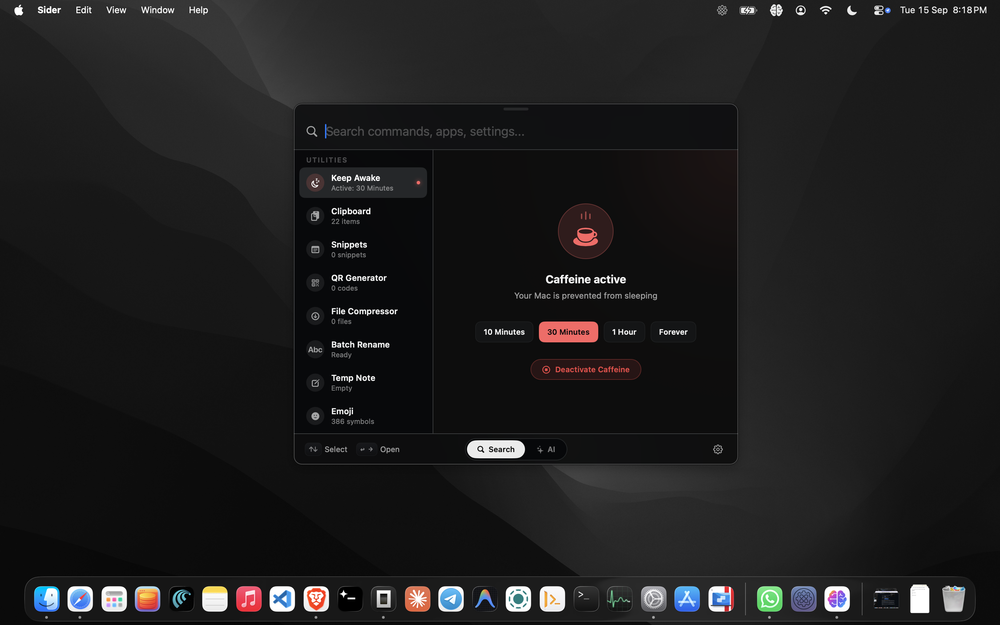
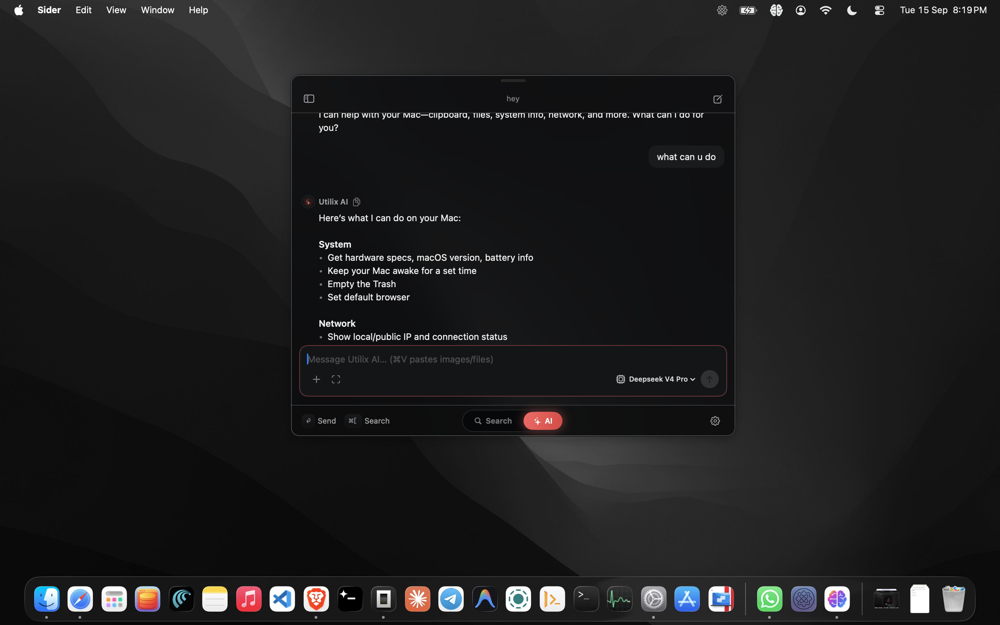
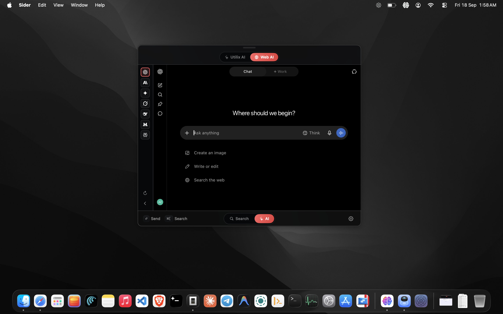
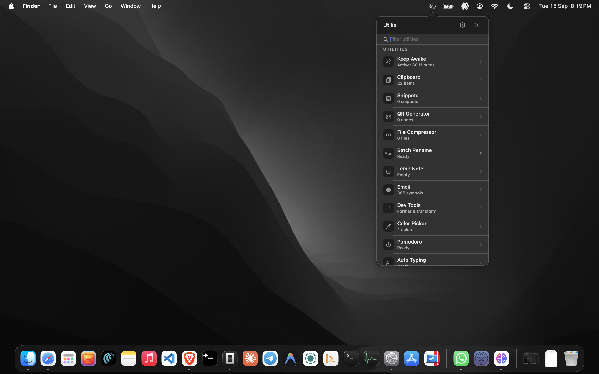
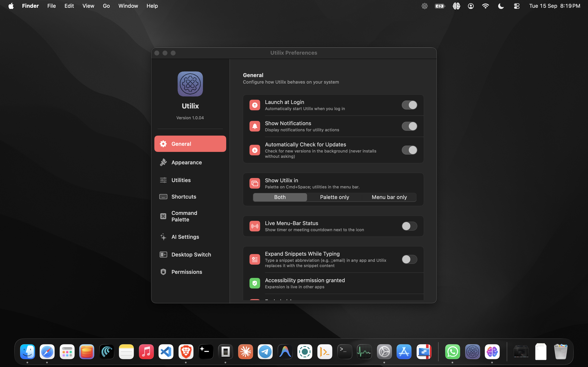

# Utilix: Community Repository

This is the public, community-facing repository for Utilix. The app itself is closed‑source; this repository is for documentation, releases, issue tracking, and community discussions only. There is no application source code in this repo.

## What is Utilix?
Utilix is a lightweight macOS menu bar app that bundles everyday utilities into one place: a ⌘Space command palette (opens on every launch), a menu-bar dropdown, and a right-click status menu — with Web AI built in (no API key needed), optional API chat (bring your own key), and silent automatic updates.

## Features
- Command Palette (⌘Space): search commands, apps, and settings from anywhere; opens automatically on every launch
- Keep Awake: prevent system sleep on demand (10 min / 30 min / 1 hour / forever)
- Clipboard History: track and reuse clipboard entries (text, images, files, links)
- Snippets: save reusable text and image snippets, expandable while typing
- QR Generator: create QR codes quickly (text, URL, Wi‑Fi, vCard, events) + scan
- File Compressor: compress images and PDFs from the menu bar
- Batch Rename: rename files by pattern, with undo
- Temp Note: jot down quick temporary notes
- Auto Typing: type clipboard content automatically, with adjustable speed
- Emoji: search and copy from 386 symbols
- Mac Vision (OCR): capture text from the screen anywhere on macOS (⌥X)
- Translate: translate, polish, and summarize text (⌥T)
- Window Snap: tile windows into halves and thirds (⌃⌥ arrow keys)
- Calendar Meetings: upcoming meetings with one-click join links (opt-in)
- Pomodoro: focus timer with menu-bar countdown
- GIF Recorder: silent short screen captures
- Dev Tools: format and transform text (JSON, Base64, URL, cases, hashes)
- Color Picker: pick and track screen colors
- Battery Health: monitor battery status at a glance
- Network Monitor: view network information
- Public IP: check your external IP address
- Speed Test: measure internet speed (simple test)
- Default Browser: quick access to your default browser settings
- Empty Trash: empty the Trash quickly
- Desktop Switch: clickable glowing edges to switch macOS desktops (enable explicitly; needs Accessibility)
- AI Chat: optional assistant with tools (bring your own API key)
- Web AI: ChatGPT, Gemini, Grok & more inside the app, no API key needed — on by default
- Global shortcuts: ⌘Space palette, ⌥X capture, ⌥T translate, ⌃⌥ snap set — all on by default
- Launch at Login: enabled automatically on first install
- What's New: release highlights in the palette

Almost everything is on out of the box. Only Calendar stays opt-in (so macOS never prompts for calendar access uninvited).

## Screenshots

### Command Palette & AI Chat

### Menu Bar & Preferences

## Download

- Go to this repository's Releases page and download the latest `.dmg` installer.
- One Universal build runs on both Apple Silicon and Intel Macs.
- Or get it on [itch.io](https://bunnysayzz.itch.io/utilix).
- New here? Each release ships an **Install Guide PDF** beside the DMG — it walks through install, the one-time macOS approval, first launch, and permissions.

## Install
1. Open the downloaded `.dmg`.
2. Drag Utilix to the `Applications` folder.
3. Double-click Utilix in Applications. macOS will block the first launch ("Not Opened") because Utilix is directly distributed: click **Done** (not Move to Bin), open **System Settings → Privacy & Security**, click **Open Anyway** next to the Utilix notice, launch again, confirm **Open Anyway**, and approve with Touch ID or password. One time only.
4. Full walkthrough with screenshots: [`docs/install.md`](docs/install.md), or the Install Guide PDF attached to every release.

## Required Permissions
Nothing is asked at launch. Each permission appears the first time its feature runs:
- Accessibility: window snap, snippet expansion, global shortcuts, auto-typing, Desktop Switch — asked on first use
- Screen Recording: Mac Vision OCR, GIF recording — asked on first capture (reopen Utilix once after granting)
- Calendars: upcoming meetings with join links — asked on first calendar open (holidays need no permission)
- Full Disk Access: Trash and file tools — macOS offers no prompt for this; flip it manually via the in-app Fix button
- Notifications: timers and meeting warnings — asked on first delivery

Manage everything live in Settings → Permissions (status + deep links). See `docs/permissions.md` for the full guide.

## Shortcuts
- Command palette: ⌘Space, opens on every launch (disable Spotlight's shortcut first, the app guides you).
- Mac Vision capture: ⌥X · Translate selection: ⌥T · Window Snap: ⌃⌥ arrows/numbers — all enabled by default, toggle in Settings → Shortcuts.

## Privacy
Your data stays on your Mac. Clipboard history, snippets, notes, and preferences are stored locally. Utilix does not send your data to any server.
The optional API Chat sends only what you type to the provider you configured, using your own API key (stored in the macOS keychain). Web AI loads provider websites you choose to visit — same as using them in a browser.

## Support & Community
- Open a Bug Report or Feature Request from the Issues tab (templates provided) — or from inside the app via the bug icon.
- Full docs: [`docs/`](docs/) (start at [`docs/getting-started.md`](docs/getting-started.md)).
- For general info and updates, see the [itch.io page](https://bunnysayzz.itch.io/utilix)
- Contact: [stfuazzo@gmail.com](mailto:stfuazzo@gmail.com)

## Contributing
Contributions are welcome for documentation, issue triage, and ideas. Please read `CONTRIBUTING.md` and follow the issue templates. Pull requests should be documentation‑only.

## Disclaimer
- This repository contains no application source code.
- Binary releases are provided for user convenience. Use at your own discretion.
