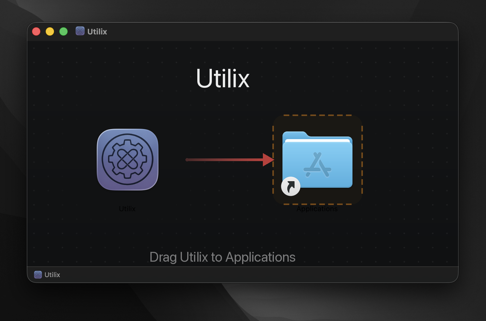
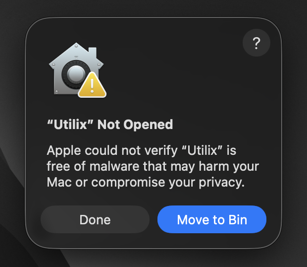
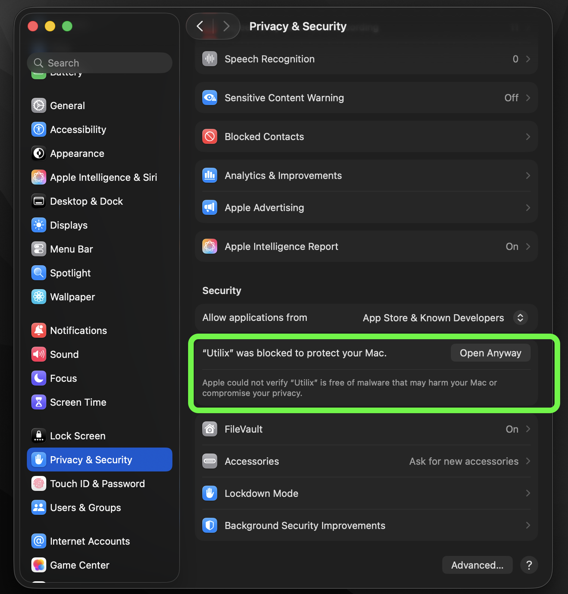
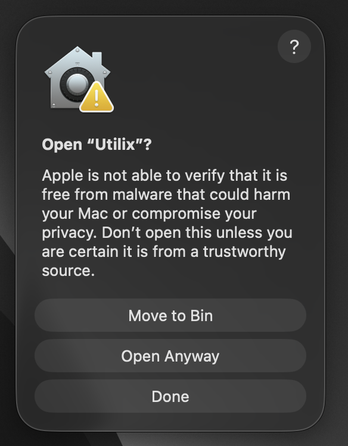
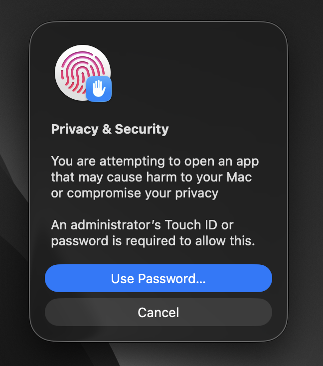

# Installing Utilix

One Universal build runs on both Apple Silicon and Intel Macs. Every
release also ships an **Install Guide PDF** beside the `.dmg` with these
same steps illustrated.

## 1. Download and drag-install

Download the latest `.dmg` from the [Releases page](https://github.com/bunnysayzz/utilix/releases)
(or [itch.io](https://bunnysayzz.itch.io/utilix)), open it, and **drag
Utilix into Applications**. Never run it from inside the disk image.
Eject the disk image afterwards.

## 2. First open: approve in Privacy & Security

Utilix is directly distributed (not App Store), so Gatekeeper blocks the
very first launch. This is expected — do **not** choose Move to Bin.

Click **Done**, open **System Settings → Privacy & Security**, scroll to
the Security section, and click **Open Anyway** next to the Utilix notice.

## 3. Confirm and authenticate

Launch Utilix again, confirm **Open Anyway** in the dialog, then approve
with Touch ID or your password. macOS remembers this — you only do it once.

## 4. First launch

- The **Utilix icon appears in the menu bar** and the **command palette
  opens automatically** (press ⌘Space anytime later; disable Spotlight's
  ⌘Space first and the app guides you).
- **22 utilities are already on** (clipboard, snippets, OCR, AI chat,
  shortcuts, and more). Only Calendar stays opt-in.
- Utilix registers itself to **launch at login** on first install
  (toggle in Settings → General).
- Updates install themselves silently in the background — no action needed.

## 5. Permissions: asked when you use them

Nothing is asked at launch. Each permission appears the first time its
feature runs; manage everything live in **Settings → Permissions**:

| Permission | Powers | Asked |
|---|---|---|
| Accessibility | Window snap, snippets, hotkeys, auto-typing, Desktop Switch | First use |
| Screen Recording | Mac Vision OCR, GIF recording | First capture (reopen Utilix once after granting) |
| Calendars | Meetings with one-click join | First calendar open (holidays need none) |
| Full Disk Access | Trash, file tools | Never auto-asked — flip manually via the in-app Fix button |
| Notifications | Timers, meeting warnings | First delivery |

## 6. Keys and data

- **Web AI** (ChatGPT, Gemini, Grok, …) works immediately — no key needed.
- **API chat** needs your own provider key: Settings → AI Settings → Add key
  (stored in the macOS keychain).
- Everything else lives on your Mac (`~/Library/Application Support/Utilix`).
  Uninstall anytime: quit, delete the app, optionally remove its preferences
  and support folder.

Stuck? See [troubleshooting](troubleshooting.md) or open an issue with your
macOS version, chip, Utilix version, and steps.
